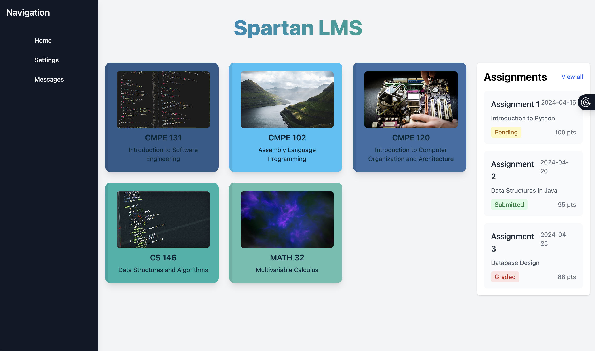

# CMPE131-LMS

Learning management system project for CMPE131 class.

## Installation

1. **Clone the repository** (if applicable) or navigate to the project directory:

   cd CMPE131-LMS

2. **Create a virtual environment** (recommended):

   python3 -m venv venv

3. **Activate the virtual environment**:
     source venv/bin/activate

4. **Install dependencies**:

   pip install -r requirements.txt

## Run

1. **Make sure your virtual environment is activated** (see Installation step 3)

2. **Run the application**:
   python run.py

3. **Access the application**:
   Open your web browser and navigate to:

   http://localhost:5000

   http://127.0.0.1:5000

## Screenshot

*Screenshot of the rendered home page showing the course cards and assignments sidebar.*
